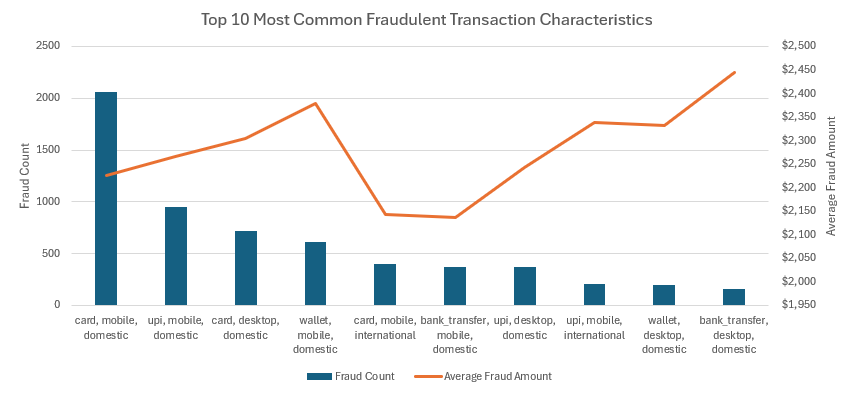
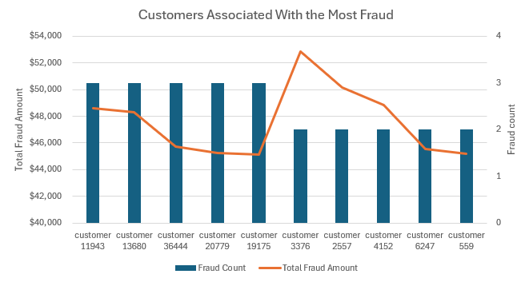
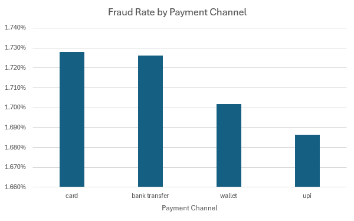
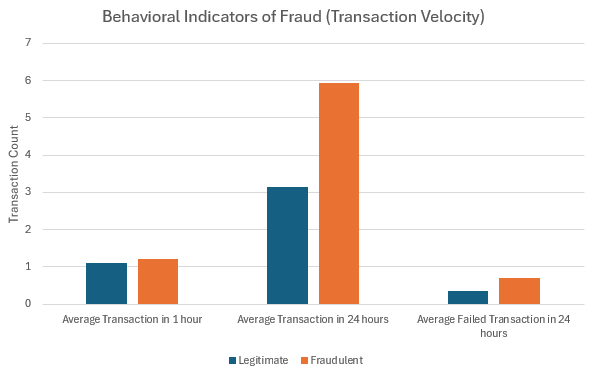
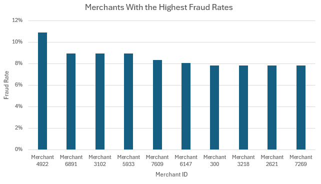

# Introduction

🔍 Exploring financial fraud through data!  
This project analyzes **transaction fraud patterns** using SQL to uncover suspicious behaviors, high-risk customers, and vulnerable payment channels.

By investigating fraud across multiple dimensions, this project identifies patterns that could help **fraud analysts, financial institutions, and security teams detect and prevent fraudulent transactions more effectively.**

📊 The analysis focuses on:

- Detecting **common characteristics of fraudulent transactions**
- Identifying **customers frequently associated with fraud**
- Measuring **fraud rates across payment channels**
- Understanding **behavioral transaction patterns linked to fraud**
- Discovering **merchants with unusually high fraud rates**

### Project File
[Check out my work here!](Digital_Payment_Fraud_Project)

---

# Tools I Used

For this fraud detection analysis, I used several core tools:

- **SQL:** The primary tool used to explore and analyze transaction data.
- **PostgreSQL:** Database system used to store and query transaction records.
- **Visual Studio Code:** Used to write and execute SQL queries.
- **Git & GitHub:** Version control and project sharing.

---

# The Analysis

Each SQL query investigates a specific fraud-related question within the transaction dataset.

---

# 1. Most Common Fraudulent Transaction Characteristics

This query identifies **the most common patterns found in fraudulent transactions**.

It analyzes fraud across:

- **Payment Channel** (card, wallet, UPI, bank transfer)
- **Device Type** (mobile, desktop, tablet)
- **International vs Domestic Transactions**

```sql
SELECT
    payment_channel,
    device_type,
    is_international,
    COUNT(*) AS fraud_count,
    ROUND(AVG(transaction_amount), 2) AS avg_fraud_amount
FROM
    transactions
WHERE
    is_fraud = TRUE
GROUP BY
    payment_channel,
    device_type,
    is_international
ORDER BY
    fraud_count DESC;
```

### Key Insights

- **Mobile + Card Fraud Dominates:** Card payments on mobile devices represent the largest number of fraud cases.
- **Digital Payment Systems Targeted:** Mobile-based UPI and wallet transactions also appear frequently in fraud cases.
- **Domestic Fraud Is More Common:** Most fraud occurs within domestic transactions rather than international ones.
- **Typical Fraud Amount:** Fraud transaction values generally fall between **$2,100 – $2,400**.

### Visualization Placeholder



*Bar chart showing the most common fraudulent transaction patterns by payment channel and device type.*

---

# 2. Customers Associated With the Most Fraud

This analysis identifies **customers linked to the highest number of fraudulent transactions**.

It measures:

- Total transactions per customer
- Number of fraudulent transactions
- Total fraud value associated with the account

```sql
SELECT
    customer_id,
    COUNT(*) AS total_transactions,
    SUM(is_fraud::INT) AS fraud_count,
    ROUND(SUM(transaction_amount), 0) AS total_fraud_amount
FROM
    transactions
GROUP BY
    customer_id
HAVING
    SUM(is_fraud::INT) > 0
ORDER BY
    fraud_count DESC
LIMIT 100;
```

### Key Insights

- **Repeat Fraud Behavior:** Several customers are linked to multiple fraud cases.
- **Fraud Often Occurs in Active Accounts:** Fraud is commonly embedded within otherwise normal transaction activity.
- **Financial Impact Varies:** Some customers are associated with significantly larger fraud losses.
- **Investigation Prioritization:** Ranking customers by fraud count helps prioritize fraud investigations.

### Visualization Placeholder



*Chart displaying customers associated with the highest number of fraudulent transactions.*

---

# 3. Fraud Rate by Payment Channel

This query evaluates **which payment methods have the highest fraud rates**.

```sql
SELECT
    payment_channel,
    COUNT(transaction_id) AS total_transactions,
    SUM(is_fraud::INTEGER) AS fraud_transactions,
    ROUND((SUM(is_fraud::INTEGER)::DECIMAL(10,2) / COUNT(transaction_id)) * 100, 3) AS fraud_rate
FROM
    transactions
GROUP BY
    payment_channel
ORDER BY
    fraud_rate DESC;
```

### Key Insights

- **Card Transactions Have the Highest Fraud Rate (~1.728%)**
- **Bank Transfers Follow Closely (~1.726%)**
- **Wallet and UPI Show Slightly Lower Rates**
- **Fraud Risk Exists Across All Channels**

Even though the rates are close, these differences help financial institutions **prioritize fraud controls for higher-risk channels.**

### Visualization Placeholder



*Bar chart comparing fraud rates across payment channels.*

---

# 4. Behavioral Indicators of Fraud (Transaction Velocity)

Fraud detection systems often monitor **behavioral activity patterns**, such as rapid bursts of transactions or repeated failures.

This query compares **transaction velocity metrics** between fraudulent and legitimate transactions.

```sql
WITH velocity_analysis AS (
    SELECT
        txn_count_1h,
        txn_count_24h,
        failed_txn_count_24h,
        is_fraud
    FROM transactions
)

SELECT
    is_fraud,
    ROUND(AVG(txn_count_1h), 2) AS avg_txn_1h,
    ROUND(AVG(txn_count_24h), 2) AS avg_txn_24h,
    ROUND(AVG(failed_txn_count_24h), 2) AS avg_failed_txn_24h
FROM velocity_analysis
WHERE
    txn_count_1h IS NOT NULL
    AND txn_count_24h IS NOT NULL
    AND failed_txn_count_24h IS NOT NULL
GROUP BY is_fraud
ORDER BY is_fraud;
```

### Key Insights

- **Higher Transaction Burst Activity:** Fraudulent transactions show slightly higher activity within 1 hour.
- **Higher Daily Transaction Volume:** Fraudulent accounts show nearly **double the 24-hour transaction activity**.
- **More Failed Transactions:** Fraudulent activity includes significantly more failed attempts.

These behavioral indicators reinforce why **transaction velocity monitoring is widely used in fraud detection systems.**

### Visualization Placeholder



*Comparison chart showing behavioral differences between legitimate and fraudulent transactions.*

---

# 5. Merchants With the Highest Fraud Rates

This analysis identifies **merchants with unusually high fraud rates**, which may indicate weak controls or targeted fraud attacks.

```sql
WITH merchant_fraud_analysis AS (
    SELECT
        merchant_id,
        COUNT(DISTINCT transaction_id) AS total_transactions,
        SUM(is_fraud :: INT) AS total_fraud
    FROM 
        transactions
    GROUP BY merchant_id
)

SELECT
    merchant_id,
    ROUND(total_fraud::DECIMAL / NULLIF(total_transactions, 0), 4) AS fraud_rate
FROM
    merchant_fraud_analysis
WHERE 
    total_transactions > 50
ORDER BY
    fraud_rate DESC
LIMIT 10;
```

### Key Insights

- **Top merchants show fraud rates between ~7.8% and 10.9%**, significantly higher than typical fraud rates.
- **Clusters of merchants share similar fraud patterns**, suggesting targeted fraud activity.
- Filtering merchants with **more than 50 transactions** ensures reliable fraud rate calculations.

### Visualization Placeholder



*Chart displaying merchants with the highest fraud rates.*

---

# What I Learned

This project strengthened several SQL and analytical skills:

- **Advanced SQL Querying:** Used aggregation, filtering, and grouping to uncover fraud patterns.
- **Common Table Expressions (CTEs):** Improved query structure and readability.
- **Fraud Pattern Analysis:** Learned how transaction characteristics and behaviors indicate suspicious activity.
- **Risk Identification:** Applied data analysis techniques to detect high-risk customers and merchants.

---

# Conclusions

## Key Insights

1. **Mobile card transactions are the most common fraud pattern.**
2. **Fraud often occurs within active customer accounts rather than isolated accounts.**
3. **Card and bank transfer channels show slightly higher fraud rates.**
4. **Behavioral signals like rapid transaction bursts and failed attempts strongly correlate with fraud.**
5. **Certain merchants show unusually high fraud rates, making them candidates for further monitoring.**

---

# Closing Thoughts

This project demonstrates how **SQL can be used to investigate fraud patterns and extract meaningful insights from transaction data.**

These insights can help financial institutions:

- Strengthen fraud detection systems
- Prioritize monitoring for high-risk accounts
- Improve payment channel security
- Identify merchants requiring investigation

As digital payments grow, **data analysis and fraud detection will continue to play a critical role in protecting financial ecosystems.**

